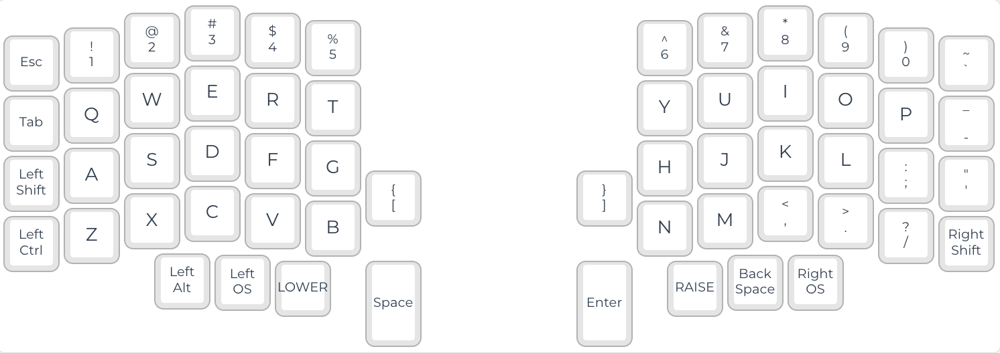
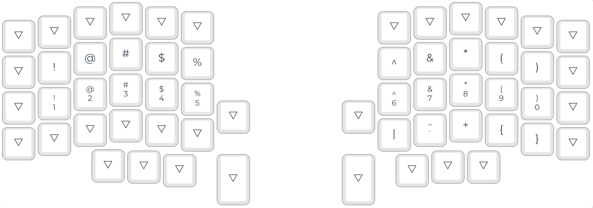
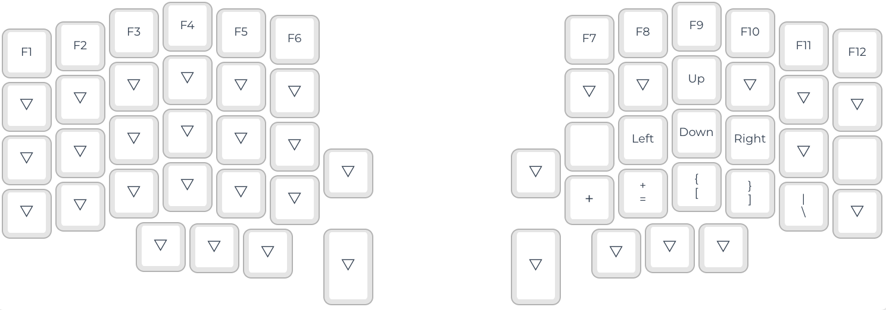

# Lily58 Keyboard configuration

This repo includes my custom QMK configuration and layouts of the Lily58 pro keyboard.

This should compile and run with no issues assuming:
* Lily58 Pro
  * Use Arduino Pro Micro microcontroller or clone.
  * No RGB or underglow.
  * OLED display.
  * Left-side as master.

## What does this do?

The `keymap.c` file includes the layout and the OLED displays configuration.

The OLED display on the left side show your current WPM and what layer you are on.

The OLED display on the right side includes a Bongo Cat animation loop based on your WPMs.

## Layout
This is the layout that I'm ussing on my Lily58.

### QWERTY Layout

### Raise Layout

### Lower Layout

### Adjust Layout

## How to use it

You can flash this configuration on your Lily58 Pro following the steps described on the [QMK webpage](https://docs.qmk.fm/#/).